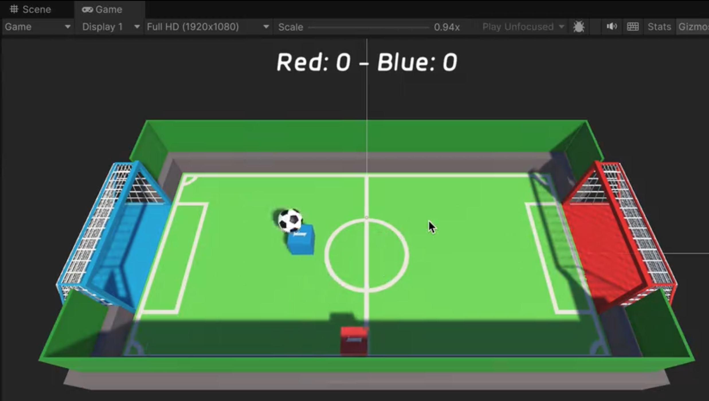

# GameServer

## 简介

### 初始化

- 安装依赖
```shell
donet restore
```

- 初始化子模块
```shell
git submodule update --init --recursive
```


### 命令速查
- 移除子模块
```shell
git submodule deinit XXXXXX
git rm XXXXXX
rm -rf .git/modules/XXXXXX
```


## JoltServer
基于JoltPhysics的物理系统服务器,为Unity游戏提供物理服务
```shell

```


### Soccer Game Demo

