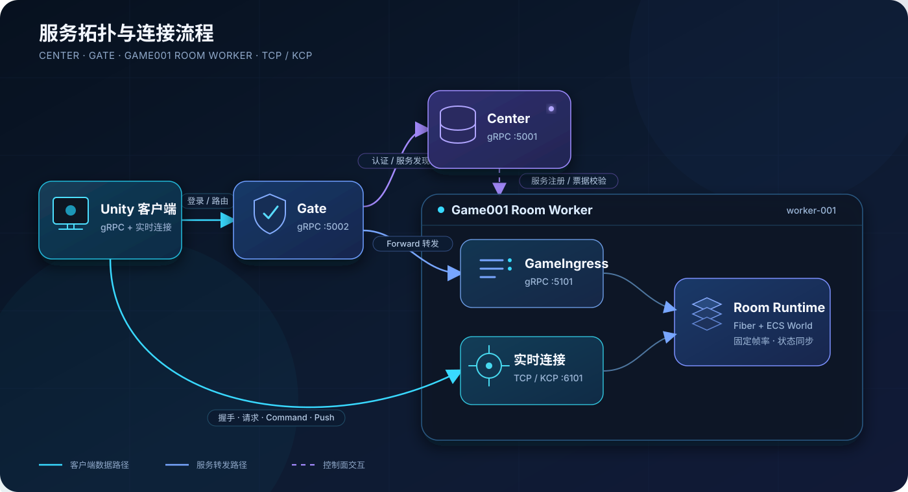

# GameServer

一个面向 Unity 客户端的多人游戏服务端框架示例。项目基于 .NET 10，按 `Center`、`Gate`、`Room` 拆分服务，使用 gRPC 完成服务间通信与入口请求，使用 TCP/KCP 承载客户端与房间服之间的实时通信，并提供房间 Fiber、ECS 状态同步、协议与业务代码生成等基础能力。

当前仓库内的 `Game001` 是一套可运行的示例游戏实现。

## 核心能力

- **服务拆分**：Center 负责认证和服务发现，Gate 负责客户端入口与路由，Room Worker 承载房间逻辑。
- **实时传输**：客户端完成登录和路由发现后，可通过 TCP 或 KCP 直连 Room Worker。
- **房间运行时**：每个房间运行在独立 Fiber 中，支持固定帧率更新、生命周期管理和连接绑定。
- **ECS 同步**：基于 Friflo ECS 提供全量快照、增量变更、脏标记和客户端世界重建。
- **消息模型**：gRPC/Protobuf 用于服务入口与服务间通信，MemoryPack 用于实时业务消息序列化。
- **代码生成**：支持请求路由、Room Command、Room RPC、ECS 组件注册以及 Unity 客户端代码生成。
- **配置生成**：内置 Luban 工具链，可从 Excel 配置表生成 C# 代码和 JSON 数据。
- **Unity 共享包**：核心协议和 Game001 协议以 Unity Package 形式维护，减少客户端与服务端协议偏差。

## 架构



默认请求流程：

1. 客户端通过 Gate 使用 `guest` 登录，Center 生成内存 Token。
2. 客户端通过 Gate 查询 Room Worker，或指定 `GameType + Target + RouteId`。
3. Gate 从 Center 获取 Worker 的直连地址，并将 Token 作为 `connect_ticket` 返回。
4. 客户端使用 TCP/KCP 连接 Room Worker，握手通过后收发房间请求、Command 和状态 Push。

## 技术栈

- .NET 10 / ASP.NET Core
- gRPC / Protobuf
- MemoryPack
- Friflo.Engine.ECS
- Serilog
- NUnit
- Unity 2021.3+
- Luban
- TCP（Telepathy）/ KCP

仓库还包含 Jolt Physics 和 zstd 的 .NET/Unity 原生封装项目，当前与 Game001 房间主链路相互独立。

## 目录结构

| 路径 | 说明 |
| --- | --- |
| `GameServer.Core` | gRPC 运行时、Fiber、房间运行时、实时网络协议和 ECS 复制基础设施 |
| `GameServer.Center` | 登录认证、Token 校验、服务注册与发现 |
| `GameServer.Gate` | 客户端入口、登录代理、Worker 查询、直连准备和请求转发 |
| `GameServer.Startup.Center` | Center 独立进程入口 |
| `GameServer.Startup.Gate` | Gate 独立进程入口 |
| `Game001.Core` | Game001 共享消息、ECS 组件和配置访问代码 |
| `Game001.Room` | Game001 房间、系统、请求处理器、Command 与 RPC 实现 |
| `Game001.Startup.Room` | Game001 Room Worker 独立进程入口 |
| `Game001.Startup.Debug` | Center、Gate、Room 一体化本地调试入口 |
| `GameServer.SourceGenerators` | 编译期网络请求与 ECS 注册源生成器 |
| `Game001.CodeGenerator` | Room 路由、Command、RPC 和 Unity 侧代码生成器 |
| `Configs` | Protobuf、Luban 配置表、生成脚本和工具 |
| `GameServer.Core.Tests` | 房间、RPC、ECS 同步和代码生成测试 |
| `UnityToolkit` | 实时网络等公共能力，作为 Git Submodule 引入 |
| `JoltPhysics` / `zstd` | 跨平台原生库的 .NET/Unity 封装 |
| `Docs` | 设计文档 |

## 环境要求

- [.NET SDK 10.0](https://dotnet.microsoft.com/)
- Git
- Bash（运行生成脚本时需要）
- Unity 2021.3 或更高版本（仅客户端集成需要）

克隆仓库并初始化子模块：

```bash
git clone --recurse-submodules https://github.com/NicoIer/GameServer.git
cd GameServer
```

如果仓库已经克隆：

```bash
git submodule update --init --recursive
```

## 快速开始

还原依赖并构建：

```bash
dotnet restore GameServer.slnx
dotnet build GameServer.slnx
```

本地开发推荐使用一体化调试入口，它会在同一进程中启动 Center、Gate 和 Game001 Room：

```bash
dotnet run --project Game001.Startup.Debug
```

启动成功后，默认监听：

| 服务 | 地址/端口 | 用途 |
| --- | --- | --- |
| Center | `http://127.0.0.1:5001` | 认证、Token、服务注册与发现 |
| Gate | `http://127.0.0.1:5002` | 客户端 gRPC 入口 |
| Game001 Room gRPC | `http://127.0.0.1:5101` | Gate 到 Room 的转发入口 |
| Game001 Room Direct | `127.0.0.1:6101` | 客户端 TCP/KCP 实时连接 |

按 `Ctrl+C` 可依次停止所有服务。日志同时输出到控制台和当前工作目录下的 `logs/`。

### 调整调试端口

一体化入口支持命令行参数：

```bash
dotnet run --project Game001.Startup.Debug -- \
  --center-port 5001 \
  --gate-port 5002 \
  --game001-room-port 5101 \
  --game001-room-tcp-port 6101 \
  --game001-room-frame-rate 50 \
  --game001-room-direct-protocol tcp
```

对应环境变量为：

- `CENTER_PORT`
- `GATE_PORT`
- `GAME001_ROOM_PORT`
- `GAME001_ROOM_TCP_PORT`
- `GAME001_ROOM_FRAME_RATE`
- `GAME001_ROOM_DIRECT_PROTOCOL`，可取 `tcp` 或 `kcp`

## 拆分服务运行

生产形态或多进程调试时，按顺序在不同终端启动：

```bash
# 终端 1
dotnet run --project GameServer.Startup.Center

# 终端 2
dotnet run --project GameServer.Startup.Gate

# 终端 3
dotnet run --project Game001.Startup.Room
```

三个入口分别读取各自目录中的 `appsettings.json`。也可以通过 `--config` 或 `GAME_SERVER_CONFIG` 指定配置文件：

```bash
dotnet run --project Game001.Startup.Room -- --config /path/to/room.json
```

Room Worker 的主要配置项如下：

| 配置项 | 默认值 | 说明 |
| --- | --- | --- |
| `gameType` | `Game001` | 游戏类型 |
| `target` | `room-worker` | 服务目标名 |
| `routeId` | `worker-001` | Worker 路由标识；多实例时必须唯一 |
| `grpcPort` | `5101` | Gate 转发入口端口 |
| `grpcAddress` | `http://127.0.0.1:5101` | 注册到 Center 的 gRPC 地址 |
| `directProtocol` | `Tcp` | 客户端直连协议：`Tcp` 或 `Kcp` |
| `directTcpPort` | `6101` | 客户端直连端口；选择 KCP 时仍使用该字段 |
| `directAddress` | `127.0.0.1:6101` | 返回给客户端的可访问地址 |
| `frameRate` | `50` | 房间逻辑帧率 |
| `networkTickMs` | `1` | 网络更新间隔 |

部署到其他机器或容器时，需要将 `grpcAddress` 和 `directAddress` 改成 Gate、客户端实际可访问的地址。

## 测试

运行核心测试：

```bash
dotnet test GameServer.Core.Tests/GameServer.Core.Tests.csproj
```

运行解决方案中的全部测试项目：

```bash
dotnet test GameServer.slnx
```

测试覆盖 ECS 脏数据合并、全量/增量同步、Room Command、Room RPC、房间同步和代码生成等关键路径。

## 协议与代码生成

生成文件已提交到仓库，日常构建不要求每次重新生成。修改协议、共享消息或配置表后，请执行对应生成流程并提交生成结果。

### Protobuf / gRPC

协议源文件位于 `Configs/Proto/`：

```bash
dotnet restore GameServer.Core/GameServer.Core.csproj
bash Configs/Proto/gen_proto.sh
```

生成结果写入 `GameServer.Core/UnityPackage/Runtime/Generated/`。脚本会先清理该目录顶层已有的 `.cs` 文件，请勿在此处手写源码。

### Room、RPC 与 ECS 代码

```bash
dotnet run --project Game001.CodeGenerator
```

生成器会扫描 `Game001.Core` 中的特性和消息定义，并更新：

- `Game001.Room/Generated/`
- `Game001.Room/Handlers/`
- `Game001.Core/UnityPackage/Runtime/Generated/`
- Unity 客户端中的 Game001 生成目录

默认 Unity 项目路径为仓库同级的 `../Game001`，也可以显式指定：

```bash
dotnet run --project Game001.CodeGenerator -- --unity-root /path/to/Game001
```

处理器文件只在缺失时创建，已存在的业务实现不会被生成器覆盖。

### Luban 配置

设计表位于 `Configs/Game001/Design/Datas/`：

```bash
bash Configs/Game001/Design/gen_design.sh
```

服务端配置数据输出到 `Configs/Game001/Generated/Luban/`，共享 C# 代码输出到 `Game001.Core/UnityPackage/Runtime/Generated/`。客户端数据默认输出到同级 Unity 工程 `../Game001/Assets/Games/Game001/Game001Resource/Configs/`，因此运行前需要准备该目录结构。

## Unity 客户端共享代码

以下目录是可供 Unity Package Manager 引用的本地包：

- `GameServer.Core/UnityPackage`：通用网络、协议、房间和 ECS 复制代码
- `Game001.Core/UnityPackage`：Game001 消息、组件和生成代码
- `JoltPhysics/JoltPhysics`：Jolt Physics Unity 包
- `zstd/zstd`：zstd Unity 包

服务端和客户端共享的消息或组件应优先放入对应 `UnityPackage/Runtime/`，并确保相关类型满足 MemoryPack 的序列化约束。

## 第三方引用说明

感谢以下开源项目为本仓库提供基础能力。下表列出项目直接引用或随仓库分发的主要第三方组件；具体版本以各 `.csproj`、Git Submodule 记录和工具文件为准。

### NuGet 与开发依赖

| 组件 | 仓库内版本 | 用途 | 许可证 |
| --- | --- | --- | --- |
| [Google.Protobuf](https://github.com/protocolbuffers/protobuf) | `3.35.1` | Protobuf C# 运行时 | BSD-3-Clause |
| [gRPC for .NET](https://github.com/grpc/grpc-dotnet) / [gRPC Tools](https://github.com/grpc/grpc) | `2.71.0` / `2.76.0` | ASP.NET Core gRPC 服务、客户端和协议代码生成 | Apache-2.0 |
| [MemoryPack](https://github.com/Cysharp/MemoryPack) | `1.21.4` | 实时业务消息和 ECS 组件二进制序列化 | MIT |
| [Friflo.Engine.ECS](https://github.com/friflo/Friflo.Engine.ECS) | `3.6.0` | 服务端与客户端 ECS 世界、查询和状态复制 | MIT |
| [Box2D.NET](https://github.com/ikpil/Box2D.NET) | `3.1.654` | Game001 的 2D 物理能力 | MIT |
| [Serilog](https://github.com/serilog/serilog) 及其 Extensions/Sinks | Core `4.3.1` | 结构化日志、异步控制台输出和滚动文件 | Apache-2.0 |
| [Roslyn](https://github.com/dotnet/roslyn) / [Roslyn Analyzers](https://github.com/dotnet/roslyn-analyzers) | `4.3.0` / `3.3.4` | 编译期 Source Generator 与业务代码生成 | MIT |
| [NUnit](https://github.com/nunit/nunit)、[VSTest](https://github.com/microsoft/vstest) 与 [coverlet](https://github.com/coverlet-coverage/coverlet) | NUnit `4.3.2`、VSTest `17.14.0`、coverlet `6.0.4` | 单元测试、测试适配和覆盖率采集 | MIT |

Serilog 扩展包和 Sink 的精确版本可在 `GameServer.Core/GameServer.Core.csproj` 中查看；NUnit Adapter、Analyzer 等测试工具版本可在各测试项目中查看。

### 随仓库分发或以源码引入

| 组件 | 引入方式 | 用途 | 许可证/说明 |
| --- | --- | --- | --- |
| [UnityToolkit](https://github.com/NicoIer/UnityToolkit) | Git Submodule，提交 `d7430e6` | Unity/.NET 公共运行时与实时网络封装 | MIT；详见其 [LICENSE](UnityToolkit/UnityToolkit/LICENSE) 和 [THIRD PARTY NOTICES](UnityToolkit/UnityToolkit/THIRD%20PARTY%20NOTICES.md) |
| [Telepathy](https://github.com/MirrorNetworking/Telepathy) / [kcp2k](https://github.com/MirrorNetworking/kcp2k) | 随 UnityToolkit 源码引入 | TCP 与 KCP 实时传输 | MIT；Telepathy 许可证保存在 `UnityToolkit/UnityToolkit/Core/Network/Core/Shared/Protocol/telepathy/LICENSE` |
| [Luban](https://github.com/focus-creative-games/luban) | `Configs/Tools/Luban/` 中的预编译工具，程序集版本 `4.9.0` | Excel 配置表到 C# / JSON 的生成 | MIT |
| [Protocol Buffers Compiler](https://github.com/protocolbuffers/protobuf) | `Configs/Tools/protoc/` 中的预编译工具，`libprotoc 3.13.0` | 生成 Protobuf 与 gRPC C# 代码 | BSD-3-Clause |
| [Jolt Physics](https://github.com/jrouwe/JoltPhysics)、[JoltC/JoltPhysicsSharp](https://github.com/amerkoleci/JoltPhysicsSharp) | `JoltPhysics/` 源码、生成绑定和跨平台原生库 | 3D 物理与 C# 绑定 | 上游组件为 MIT，许可证副本位于 `JoltPhysics/JoltPhysics/THIRD_PARTY_LICENSES/` |
| [Zstandard](https://github.com/facebook/zstd) | `zstd/` 生成绑定和跨平台原生库 | 压缩、解压和差分 Patch | BSD-3-Clause 或 GPL-2.0；本仓库保留了 `zstd/zstd/Plugins/native/LICENSE` 与 `COPYING` |

UnityToolkit 内还引用了 Mirror Networking、KDTree、Octree、LoopScrollRect 等组件，请同时查阅其第三方声明和各子目录的 `LICENSE`。

> 本项目自身代码使用 MIT License。第三方组件以及包含独立许可证的子目录仍遵循其各自许可证；分发时请保留适用的版权与许可证声明。

## 当前实现说明

- Center 的 Token 和服务注册表保存在内存中，进程重启后会丢失。
- 默认只注册了 `guest` 登录方式；`credential` 为空时使用 `device_id` 生成稳定 UID。
- 默认配置面向本机开发，不包含 TLS、持久化、限流、监控、跨节点一致性或正式鉴权。
- `routeId` 为空时 Center 会返回首个匹配的 Worker；正式环境建议始终显式选择路由。

这些行为适合本地开发和架构验证，面向生产环境时应根据部署模型补齐相应基础设施。

## 许可证

本项目基于 [MIT License](LICENSE) 开源。第三方组件及独立子项目的授权方式请参阅上方“第三方引用说明”和其各自的许可证文件。
